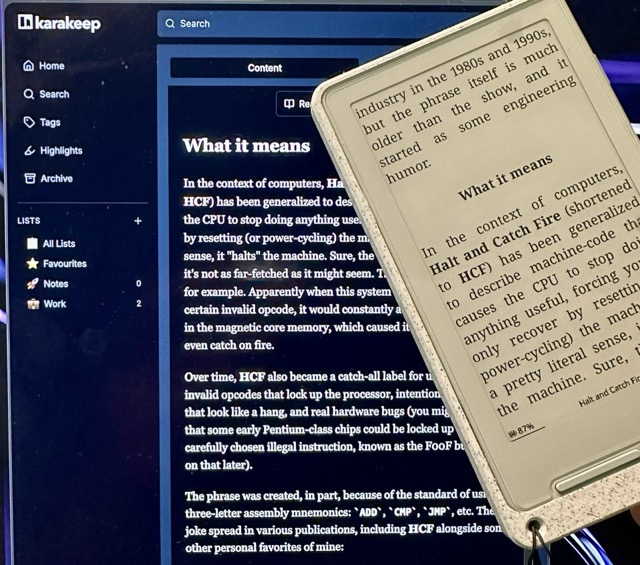

# karakeep-opds

Standalone bridge that exposes [Karakeep](https://github.com/karakeep-app/karakeep)
bookmarks as OPDS feeds for OPDS-capable readers.



## Features

- OPDS 1.2 Atom feeds at `/opds`
- OPDS 2 JSON feeds at `/opds2` (NOTE: Crosspoint/Xteink do not support OPDS 2)
- Recent bookmarks and search feeds
- Supports Karakeep `link` and `text` bookmarks
- Generates minimal EPUB files for OPDS acquisition links

## Quick Setup

Create your `.env` file, then create a `docker-compose.yml`:

```yaml
services:
  karakeep-opds:
    image: ghcr.io/yazdipour/karakeep-opds:latest
    ports:
      - "8000:8000"
    env_file: .env
```
Run `docker compose up -d`.


### Configuration - `.env`

Copy `.env.example` to `.env` and fill in the required values:

```.env
KARAKEEP_BASE_URL=127.0.0.1:3000 # [Required] Karakeep origin
KARAKEEP_API_TOKEN=XXXXX # [Required] API key from Karakeep Settings > API Keys
OPDS_USERNAME=XXX # [Required] Username entered in your OPDS reader
OPDS_PASSWORD=XXX # [Required] Password entered in your OPDS reader; any non-empty value

OPDS_PAGE_SIZE=50 # [Optional] Page size sent to Karakeep, default 50
SERVICE_BASE_URL= # [Optional] Public origin for generated links behind reverse proxies
```

### OPDS URLs

Use these URLs in your OPDS reader:

- OPDS 1.2 catalog: `https://opds.example.com/opds`
- OPDS 1.2 recent: `https://opds.example.com/opds/recent`
- OPDS 1.2 search: `https://opds.example.com/opds/search?q=query`
- OPDS 2 catalog: `https://opds.example.com/opds2`

<details>
<summary>Run locally</summary>

```bash
python -m venv .venv
. .venv/bin/activate
pip install -e ".[dev]"
uvicorn karakeep_opds.app:app --reload
```
</details>

<details>
<summary>Run with Docker</summary>

You can run the application using the pre-built Docker image from GHCR using `docker-compose`. Create a `.env` file first as shown above.

Using the pre-built image (GHCR):
```bash
docker run -d \
  --name karakeep-opds \
  --env-file .env \
  -p 8000:8000 \
  ghcr.io/karakeep-app/karakeep-opds:latest
```
</details>

## AI Acknowledgment

This project was built with the assistance of AI tools for code generation and refactoring.

## License

This project is licensed under the [GNU General Public License v3.0 (GPLv3)](LICENSE).
